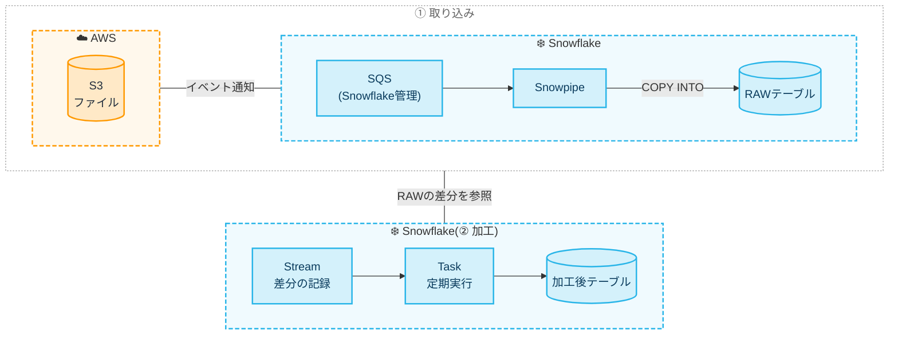

以前、Snowflake Dynamic Tablesを使って、データをELTする記事を書きました。

https://zenn.dev/fusic/articles/snowflake-dynamic-tables-for-iot

ELTとは「Extract→Load→Transform」、つまり先に保存してから必要に応じて変換することです。
Dynamic Tablesはクエリを定義するだけで変換結果が自動更新される便利な仕組みですが、取り込みの自動化や、変換処理を手続きとして組み立てたい場合には別の手段が必要です。

そこで本記事では、S3に置かれたファイルを自動で取り込み、新しく入ったデータだけを加工する方法として「Snowpipe + Stream + Task」の構成を紹介します。
この構成の解説と、実際に構築する方法について解説します。

## 全体像

構成を図で表すと次の通りです。
オレンジ色がAWS、青色がSnowflakeのリソースです。



この構成の中核を担う「Snowpipe + Stream + Task」についてそれぞれの役割は次の通りです。

| 要素 | 役割 |
| --- | --- |
| Snowpipe | ステージに置かれたファイルを、テーブルへ自動で取り込む |
| Stream | テーブルに追加・変更された行(差分)を記録する |
| Task | SQLをスケジュールに従って実行する |

## Snowpipe: ファイルを自動で取り込む

Snowpipeは、ステージ(S3などのファイル置き場)に新しいファイルが格納されたら、自動で `COPY INTO` を実行する機能です。
SQLでは「`COPY INTO` 文を中に持った `PIPE` オブジェクト」を作成することになります。

```sql
CREATE OR REPLACE PIPE MY_PIPE
  AUTO_INGEST = TRUE
AS
COPY INTO RAW_TABLE
FROM @MY_STAGE
FILE_FORMAT = (TYPE = CSV);
```

`AUTO_INGEST = TRUE` にすると、S3のイベント通知をトリガーに動きます。
S3バケット側で、PIPEに紐づくSnowflake管理のSQS(`SHOW PIPES` の `notification_channel` 列で確認できます)へイベント通知を送る設定をしておきます。

Snowpipeを使う際に知っておくべきことをまとめます。

- 実行にはユーザーのウェアハウスではなく、Snowflakeが管理するサーバーレスのリソースが使われます(課金もサーバーレス)
- 取り込み済みのファイルは記録されるため、同じファイルが二重に取り込まれることは基本的にありません(ロード履歴の保持期間は14日です)
- 数十秒〜数分程度の遅延が出るので、秒単位のリアルタイム性が必要な場合は[Snowpipe Streaming](https://docs.snowflake.com/ja/user-guide/snowpipe-streaming/data-load-snowpipe-streaming-overview)の方が向いています
- 小さなファイルを大量に置くとファイルごとのオーバーヘッドが効いて割高になるので、ある程度まとめて置くのがおすすめです

## Stream: 「新しく入った行」を覚える

Snowpipeでテーブルにデータが入っても、そのままでは「どこまで加工済みか」が分かりません。
Streamを使うことでこの課題を解決します。

```sql
CREATE OR REPLACE STREAM RAW_TABLE_STREAM
  ON TABLE RAW_TABLE
  APPEND_ONLY = TRUE;
```

StreamはテーブルのCDC(変更データキャプチャ)のような機能で、前回読み込んだ時以降に変わった行だけを返します。
`APPEND_ONLY = TRUE` にすると INSERT のみを追跡します。
Snowpipeによる取り込みは追加のみなので、これで十分です。

```sql
SELECT * FROM RAW_TABLE_STREAM;
```

Streamを `INSERT` や `MERGE` などのDML内で使うと、そのトランザクションがコミットされた時点で「読み終わった」ことになり、次回からは新しい行だけが返ってきます。
(単なる `SELECT` ではオフセットは進みません。)

## Task: SQLを定期実行する

Taskは、SQLを指定したスケジュールで実行する機能です。cronのようなものと考えると分かりやすいと思います。

```sql
CREATE OR REPLACE TASK TRANSFORM_TASK
  WAREHOUSE = MY_WH
  SCHEDULE = '1 MINUTE'
  WHEN SYSTEM$STREAM_HAS_DATA('RAW_TABLE_STREAM')
AS
  INSERT INTO CLEAN_TABLE
  SELECT id, UPPER(name), created_at
  FROM RAW_TABLE_STREAM;

ALTER TASK TRANSFORM_TASK RESUME;
```

ポイントは `WHEN SYSTEM$STREAM_HAS_DATA(...)` の部分です。

これは「Streamに未処理の行があるときだけ実行する」という条件で、データがない間はTaskの本体が実行されず、ウェアハウスも起動しません。
余分なコンピュートコストを抑えられるので、Stream + Task を組み合わせる際にこの記述をするとよいです。

また、Taskは作成した直後は停止状態(suspended)であり、`ALTER TASK ... RESUME` で有効化する必要があります。
忘れやすいので注意しましょう。

## 「取り込み」と「加工」を分けるメリット

実際にはこのような設計とせずとも、Snowpipeの `COPY INTO` の中で変換まで終えることも可能です。
しかし、RAWテーブルに一度そのまま入れてからTaskで加工する構成にすることで、次のようなメリットがあります。

- 加工処理が失敗しても、取り込み済みのRAWデータは残っているのでやり直せる
- 加工ロジックを変更したくなったとき、元データから作り直せる
- 取り込み(サーバーレス課金)と加工(ウェアハウス課金)を分離できる。特にLLM呼び出しなど重い処理を入れる場合に、取り込みのたびに走らせずに済む

## 実際に試してみる

ここまでの流れを、S3にCSVを置いて加工結果が出るところまで、最小構成で試す手順をまとめます。

AWS CLIとSnowflakeのSQLだけで完結させます。
SQLは Snowsight のワークシートで実行しても、[Snowflake CLI](https://docs.snowflake.com/ja/developer-guide/snowflake-cli/index) の `snow sql` で実行しても構いません。

### 前提

- AWS CLI が使えること
- Snowflakeアカウントが AWS 上のリージョンにあること(auto-ingest で使うSnowflake管理のSQSが、AWS上のアカウントを前提としているため)
- 簡単のため、Snowflake側は `ACCOUNTADMIN` ロールで操作します(検証用です)

### 1. S3バケットとIAMロールを作る

バケットを作ります。バケット名は一意になるよう変えてください。

```sh
export AWS_REGION=ap-northeast-1
export BUCKET=snowpipe-task-demo-$(date +%s)
export ACCOUNT_ID=$(aws sts get-caller-identity --query Account --output text)

aws s3api create-bucket --bucket $BUCKET --region $AWS_REGION \
  --create-bucket-configuration LocationConstraint=$AWS_REGION
```

Snowflakeがバケットを読むためのIAMロールを作ります。
Snowflake側のIAMユーザーARNと外部IDは、後でStorage Integrationを作ってから分かるので、信頼ポリシーはいったん自分のアカウントにしておき、あとで書き換えます。

```sh
cat > trust.json <<JSON
{
  "Version": "2012-10-17",
  "Statement": [{
    "Effect": "Allow",
    "Principal": { "AWS": "arn:aws:iam::${ACCOUNT_ID}:root" },
    "Action": "sts:AssumeRole"
  }]
}
JSON

cat > policy.json <<JSON
{
  "Version": "2012-10-17",
  "Statement": [
    {
      "Effect": "Allow",
      "Action": ["s3:GetObject", "s3:GetObjectVersion"],
      "Resource": "arn:aws:s3:::${BUCKET}/data/*"
    },
    {
      "Effect": "Allow",
      "Action": ["s3:ListBucket", "s3:GetBucketLocation"],
      "Resource": "arn:aws:s3:::${BUCKET}"
    }
  ]
}
JSON

aws iam create-role --role-name snowpipe-task-demo \
  --assume-role-policy-document file://trust.json
aws iam put-role-policy --role-name snowpipe-task-demo \
  --policy-name s3-read --policy-document file://policy.json

export ROLE_ARN=arn:aws:iam::${ACCOUNT_ID}:role/snowpipe-task-demo
```

### 2. Snowflake側にテーブル・Snowpipeを作る

```sql
USE ROLE ACCOUNTADMIN;

CREATE DATABASE IF NOT EXISTS DEMO_DB;
CREATE SCHEMA IF NOT EXISTS DEMO_DB.PUBLIC;
USE SCHEMA DEMO_DB.PUBLIC;

CREATE WAREHOUSE IF NOT EXISTS DEMO_WH
  WAREHOUSE_SIZE = XSMALL AUTO_SUSPEND = 60 AUTO_RESUME = TRUE;

-- 取り込み先(RAW)と加工後のテーブル
CREATE OR REPLACE TABLE RAW_EVENTS (
  FILE_NAME STRING,
  ID NUMBER,
  NAME STRING,
  CREATED_AT TIMESTAMP_NTZ
);
CREATE OR REPLACE TABLE CLEAN_EVENTS (
  ID NUMBER,
  NAME STRING,
  CREATED_AT TIMESTAMP_NTZ
);

-- S3へのアクセス設定(<ROLE_ARN> と <BUCKET> は置き換える)
CREATE OR REPLACE STORAGE INTEGRATION DEMO_S3_INT
  TYPE = EXTERNAL_STAGE
  STORAGE_PROVIDER = 'S3'
  ENABLED = TRUE
  STORAGE_AWS_ROLE_ARN = '<ROLE_ARN>'
  STORAGE_ALLOWED_LOCATIONS = ('s3://<BUCKET>/data/');

CREATE OR REPLACE STAGE DEMO_STAGE
  URL = 's3://<BUCKET>/data/'
  STORAGE_INTEGRATION = DEMO_S3_INT
  FILE_FORMAT = (TYPE = CSV SKIP_HEADER = 1);

-- Snowpipe
CREATE OR REPLACE PIPE DEMO_PIPE AUTO_INGEST = TRUE AS
COPY INTO RAW_EVENTS (FILE_NAME, ID, NAME, CREATED_AT)
FROM (
  SELECT METADATA$FILENAME, $1, $2, $3
  FROM @DEMO_STAGE
)
PATTERN = '.*\\.csv';
```

### 3. IAMロールの信頼ポリシーを書き換える

Snowflake側のIAMユーザーARNと外部IDを取得します。

```sql
DESC INTEGRATION DEMO_S3_INT;
```

出力のうち、次の2つを控えます。

- `STORAGE_AWS_IAM_USER_ARN`
- `STORAGE_AWS_EXTERNAL_ID`

控えた値で信頼ポリシーを書き換えます。

```sh
export SF_IAM_USER_ARN="<STORAGE_AWS_IAM_USER_ARN>"
export SF_EXTERNAL_ID="<STORAGE_AWS_EXTERNAL_ID>"

cat > trust.json <<JSON
{
  "Version": "2012-10-17",
  "Statement": [{
    "Effect": "Allow",
    "Principal": { "AWS": "${SF_IAM_USER_ARN}" },
    "Action": "sts:AssumeRole",
    "Condition": { "StringEquals": { "sts:ExternalId": "${SF_EXTERNAL_ID}" } }
  }]
}
JSON

aws iam update-assume-role-policy --role-name snowpipe-task-demo \
  --policy-document file://trust.json
```

### 4. S3のイベント通知をSnowpipeに向ける

PIPEに紐づくSQSのARNを確認します。

```sql
SHOW PIPES LIKE 'DEMO_PIPE';
```

`notification_channel` 列の値がSQSのARNです。これをS3のイベント通知の宛先にします。

```sh
export PIPE_SQS_ARN="<notification_channel>"

cat > notification.json <<JSON
{
  "QueueConfigurations": [{
    "QueueArn": "${PIPE_SQS_ARN}",
    "Events": ["s3:ObjectCreated:*"],
    "Filter": { "Key": { "FilterRules": [{ "Name": "prefix", "Value": "data/" }] } }
  }]
}
JSON

aws s3api put-bucket-notification-configuration --bucket $BUCKET \
  --notification-configuration file://notification.json
```

### 5. ファイルを置いてSnowpipeの取り込みを確認する

CSVを作ってアップロードします。

```sh
cat > events1.csv <<CSV
id,name,created_at
1,alice,2026-10-01 10:00:00
2,bob,2026-10-01 10:05:00
CSV

aws s3 cp events1.csv s3://$BUCKET/data/events1.csv
```

しばらく待ってから(数十秒〜数分程度かかります)、RAWテーブルを確認します。

```sql
SELECT * FROM RAW_EVENTS;
```

2行入っていれば、S3 → Snowpipe の部分は成功です。
まだ0行のときは、少し待ってから再実行してください。それでも入らないときは、次のSQLでPIPEの状態を確認します。

```sql
SELECT SYSTEM$PIPE_STATUS('DEMO_PIPE');
```

### 6. StreamとTaskを作る

RAWテーブルに対するStreamと、加工用のTaskを作ります。
ここでは「名前を大文字にして `CLEAN_EVENTS` に入れる」だけの加工にします。

```sql
CREATE OR REPLACE STREAM RAW_EVENTS_STREAM
  ON TABLE RAW_EVENTS APPEND_ONLY = TRUE;

CREATE OR REPLACE TASK TRANSFORM_EVENTS_TASK
  WAREHOUSE = DEMO_WH
  SCHEDULE = '1 MINUTE'
  WHEN SYSTEM$STREAM_HAS_DATA('RAW_EVENTS_STREAM')
AS
  INSERT INTO CLEAN_EVENTS (ID, NAME, CREATED_AT)
  SELECT ID, UPPER(NAME), CREATED_AT
  FROM RAW_EVENTS_STREAM;

ALTER TASK TRANSFORM_EVENTS_TASK RESUME;
```

Streamは作成した時点以降の変更しか追跡しません。そのため、手順5で取り込んだ2行はStreamには現れません。
そこで、2つ目のファイルを置いてみます。

```sh
cat > events2.csv <<CSV
id,name,created_at
3,carol,2026-10-01 11:00:00
4,dave,2026-10-01 11:05:00
CSV

aws s3 cp events2.csv s3://$BUCKET/data/events2.csv
```

1〜2分ほど待ってから確認します。Taskの実行を待っている間は、`CLEAN_EVENTS` が0行、`RAW_EVENTS_STREAM` が2行のままのことがあります。その場合も少し待って再実行してください。

```sql
SELECT * FROM RAW_EVENTS;        -- 4行(alice, bob, carol, dave)
SELECT * FROM CLEAN_EVENTS;      -- 2行(CAROL, DAVE)
SELECT * FROM RAW_EVENTS_STREAM; -- 0行(Taskが消費済み)
```

`CLEAN_EVENTS` に `CAROL` と `DAVE` が入っていれば、S3 → Snowpipe → Stream → Task が一通りつながっています。

Taskの実行履歴は次のSQLで見られます。ファイルが来ていない間は `SKIPPED` になっていることも確認できます。

```sql
SELECT NAME, STATE, SCHEDULED_TIME, ERROR_MESSAGE
FROM TABLE(DEMO_DB.INFORMATION_SCHEMA.TASK_HISTORY(TASK_NAME => 'TRANSFORM_EVENTS_TASK'))
ORDER BY SCHEDULED_TIME DESC
LIMIT 10;
```

### 7. 後片付け

Taskを止め、作ったリソースを削除します。

```sql
ALTER TASK TRANSFORM_EVENTS_TASK SUSPEND;
DROP DATABASE DEMO_DB;
DROP WAREHOUSE DEMO_WH;
DROP STORAGE INTEGRATION DEMO_S3_INT;
```

```sh
aws s3 rb s3://$BUCKET --force
aws iam delete-role-policy --role-name snowpipe-task-demo --policy-name s3-read
aws iam delete-role --role-name snowpipe-task-demo
```

## 運用時に気をつけたいこと

- Taskは `RESUME` したまま放置すると動き続けます。検証後は `ALTER TASK ... SUSPEND` で止めておきましょう
- 実行履歴は `INFORMATION_SCHEMA.TASK_HISTORY` で確認できます。Taskが動かないときはまずここの `ERROR_MESSAGE` を見ます
- Snowpipeの状態は `SELECT SYSTEM$PIPE_STATUS('MY_PIPE')` で確認できます。取り込まれないときは、S3のイベント通知の宛先が正しいか、ステージのパスやPATTERNが合っているかを疑います
- Taskのスケジュールは `'1 MINUTE'` のような間隔指定のほか、`USING CRON` 形式も使えます

## おわりに

Snowpipe + Stream + Task を組み合わせることで「ファイルが置かれたら自動で取り込み、新しいデータだけを定期的に加工する」といった仕組みを構築できることが確認できました。

RAWデータを残したまま加工結果を自動で作れるので、加工ロジックの変更や失敗時のやり直しにも強い構成です。

## 参考文献

- [Amazon S3用Snowpipeの自動化 | Snowflake Documentation](https://docs.snowflake.com/ja/user-guide/data-load-snowpipe-auto-s3)
- [Snowpipe | Snowflake Documentation](https://docs.snowflake.com/ja/user-guide/data-load-snowpipe-intro)
- [Introduction to streams | Snowflake Documentation](https://docs.snowflake.com/ja/user-guide/streams-intro)
- [タスクの紹介 | Snowflake Documentation](https://docs.snowflake.com/ja/user-guide/tasks-intro)
