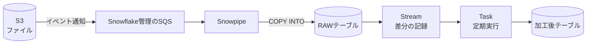

Snowflakeでデータ基盤を作るとき、「S3にファイルが置かれたら自動で取り込み、その後に加工までやりたい」という場面はよくあります。
このとき定番になるのが **Snowpipe + Stream + Task** の組み合わせです。

本記事では、この構成がどういうもので、それぞれが何を担当しているのかを簡単に整理します。

## 全体像



役割を一言でまとめると次のとおりです。

| 部品 | 役割 |
| --- | --- |
| Snowpipe | ステージに置かれたファイルを、テーブルへ自動で取り込む |
| Stream | テーブルに追加・変更された行(差分)を記録する |
| Task | SQLをスケジュールに従って実行する |

「Snowpipeで入れる」→「Streamで新しい行だけを見つける」→「Taskで加工する」という流れです。

## Snowpipe: ファイルを自動で取り込む

Snowpipeは、ステージ(S3などのファイル置き場)に新しいファイルが届いたら、自動で `COPY INTO` を実行してくれる機能です。
実体は「`COPY INTO` 文を中に持った `PIPE` オブジェクト」です。

```sql
CREATE OR REPLACE PIPE MY_PIPE
  AUTO_INGEST = TRUE
AS
COPY INTO RAW_TABLE
FROM @MY_STAGE
FILE_FORMAT = (TYPE = CSV);
```

`AUTO_INGEST = TRUE` にすると、S3のイベント通知をトリガーに動きます。
S3バケット側で、PIPEに紐づくSnowflake管理のSQS(`SHOW PIPES` の `notification_channel` 列で確認できます)へイベント通知を送る設定をしておきます。

ポイントは次のとおりです。

- 実行にはユーザーのウェアハウスではなく、Snowflakeが管理するサーバーレスのリソースが使われます(課金もサーバーレス)
- 取り込み済みのファイルは記録されるため、同じファイルが二重に取り込まれることは基本的にありません
- 数十秒〜数分程度の遅延が出るので、秒単位のリアルタイム性が必要な場合は[Snowpipe Streaming](https://docs.snowflake.com/ja/user-guide/snowpipe-streaming/data-load-snowpipe-streaming-overview)の方が向いています
- 小さなファイルを大量に置くとファイルごとのオーバーヘッドが効いて割高になるので、ある程度まとめて置くのがおすすめです

## Stream: 「新しく入った行」を覚えておく

Snowpipeでテーブルにデータが入っても、そのままでは「どこまで加工済みか」が分かりません。
そこで登場するのが Stream です。

```sql
CREATE OR REPLACE STREAM RAW_TABLE_STREAM
  ON TABLE RAW_TABLE
  APPEND_ONLY = TRUE;
```

StreamはテーブルのCDC(変更データキャプチャ)のようなもので、前回読んだ時点以降に変わった行だけを返します。
`APPEND_ONLY = TRUE` にすると INSERT のみを追跡します。Snowpipeによる取り込みは追加のみなので、これで十分です。

```sql
SELECT * FROM RAW_TABLE_STREAM;
```

Streamを `INSERT` や `MERGE` などのDML内で使うと、そのトランザクションがコミットされた時点で「読み終わった」ことになり、次回からは新しい行だけが返ってきます。
(単なる `SELECT` ではオフセットは進みません。)

## Task: SQLを定期実行する

Taskは、SQLを指定したスケジュールで実行する機能です。cronのようなものと考えると分かりやすいと思います。

```sql
CREATE OR REPLACE TASK TRANSFORM_TASK
  WAREHOUSE = MY_WH
  SCHEDULE = '1 MINUTE'
  WHEN SYSTEM$STREAM_HAS_DATA('RAW_TABLE_STREAM')
AS
  INSERT INTO CLEAN_TABLE
  SELECT id, UPPER(name), created_at
  FROM RAW_TABLE_STREAM;

ALTER TASK TRANSFORM_TASK RESUME;
```

見てほしいのは `WHEN SYSTEM$STREAM_HAS_DATA(...)` の部分です。
これは「Streamに未処理の行があるときだけ実行する」という条件で、データがない間はTaskの本体が実行されず、ウェアハウスも起動しません。
無駄なコンピュートコストを抑えられるので、Stream + Task の組み合わせでは定番の書き方です。

また、Taskは作成した直後は停止状態(suspended)なので、`ALTER TASK ... RESUME` で有効化する必要があります。ここは忘れやすいポイントです。

## なぜ「取り込み」と「加工」を分けるのか

Snowpipeの `COPY INTO` の中で変換することもできますが、あえて RAW テーブルに一度そのまま入れてから Task で加工する構成にすると、次のようなメリットがあります。

- 加工処理が失敗しても、取り込み済みのRAWデータは残っているのでやり直せる
- 加工ロジックを変更したくなったとき、元データから作り直せる
- 取り込み(サーバーレス課金)と加工(ウェアハウス課金)を分離できる。特にLLM呼び出しなど重い処理を入れる場合に、取り込みのたびに走らせずに済む

なお、加工の目的が単に「集計・変換結果を最新に保つこと」であれば、Stream + Taskを自前で組む代わりに[動的テーブル(Dynamic Tables)](https://zenn.dev/fusic/articles/snowflake-dynamic-tables-for-iot)で宣言的に書く選択肢もあります。
Taskは外部関数の呼び出しや条件分岐を含む手続き的な処理、Dynamic Tablesはクエリ定義だけで済む変換、というように使い分けるとよいでしょう。

## 運用時に気をつけたいこと

- Taskは `RESUME` したまま放置すると動き続けます。検証後は `ALTER TASK ... SUSPEND` で止めておきましょう
- 実行履歴は `INFORMATION_SCHEMA.TASK_HISTORY` で確認できます。Taskが動かないときはまずここの `ERROR_MESSAGE` を見ます
- Snowpipeの状態は `SELECT SYSTEM$PIPE_STATUS('MY_PIPE')` で確認できます。取り込まれないときは、S3のイベント通知の宛先が正しいか、ステージのパスやPATTERNが合っているかを疑います
- Taskのスケジュールは `'1 MINUTE'` のような間隔指定のほか、`USING CRON` 形式も使えます

## おわりに

Snowpipe + Stream + Task は、「ファイルが置かれたら自動で取り込み、新しいデータだけを定期的に加工する」ためのシンプルで定番の構成です。

- Snowpipe: ファイルを自動で取り込む
- Stream: 新しく入った行だけを教えてくれる
- Task: 新しい行があるときだけSQLを実行する

この3つを覚えておけば、S3を起点とした取り込み〜加工のパイプラインがSnowflakeの中だけで完結します。

## 参考文献

- [Snowpipe の紹介 | Snowflake Documentation](https://docs.snowflake.com/ja/user-guide/data-load-snowpipe-intro)
- [ストリームの紹介 | Snowflake Documentation](https://docs.snowflake.com/ja/user-guide/streams-intro)
- [タスクの紹介 | Snowflake Documentation](https://docs.snowflake.com/ja/user-guide/tasks-intro)
