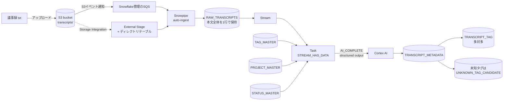

# 検証手順書: 会議議事録の文字起こしをS3に置くだけで、タグ・プロジェクト・状況をメタデータ化する

> 作成日: 2026-10-02 / 実行はまだしていない。記事執筆前に手元で上から順に試すための手順書。
> 末尾の「未確認事項リスト」にある項目は、実行時に必ず公式ドキュメントまたは実機で確認すること。

## 1. 目的と記事の想定構成

### 目的
- 会議の文字起こしテキストをS3にアップロードするだけで、Snowflake上で次のメタデータが自動生成されることを確認する。
  1. 関連するWeb/IT技術タグ(タグマスターに存在するもののみ。複数可)
  2. 関連プロジェクト(プロジェクトマスターから1つ推定。該当なしもあり)
  3. 状況(進行中 / ブロック中 / 完了 など)
  4. 要約、根拠となった発言(精度確認用)
- マスターを動的にプロンプトへ埋め込むことで、マスター更新だけで分類基準を変えられることを示す。
- マスターに無い値(未知のタグ・プロジェクト)の扱い方を決めて検証する。

### 記事の見出し案
1. はじめに(議事録が溜まるだけで検索できない問題 / 完成イメージ)
2. 全体アーキテクチャ(mermaid図)
3. マスターテーブルを用意する(タグ・プロジェクト・状況)
4. AWS側の構築(Terraform: S3、IAMロール、イベント通知)
5. Snowflake側の構築(Storage Integration / Stage / Snowpipe / Stream / Task)
6. マスターを動的に埋め込んだプロンプトとAI_COMPLETEの構造化出力
7. 多対多タグの正規化テーブルへの展開
8. 動かしてみる(議事録アップロード → メタデータ確認)
9. 精度確認とマスターに無い値の扱い
10. コストの注意点
11. まとめ / クリーンアップ

## 2. 前提条件

- Snowflakeアカウントがあり、`ACCOUNTADMIN` ロールで操作できる(既存記事と同様、権限周りは簡略化のため `ACCOUNTADMIN` 前提とする)。
- AWSアカウントがあり、S3・IAM・(必要なら)S3イベント通知を操作できる認証情報が `aws` CLI / Terraform に設定済み。
- Snowflakeアカウントが、AWS上のリージョンにある(Storage Integration / Snowpipe auto-ingestはAWS上のアカウントが前提)。
- 使用するCortexモデルが、アカウントのリージョンで利用可能(または、クロスリージョン推論を有効化する)。
- ローカルに次のツールが入っている。
  - Snowflake CLI (`snow`)。既存記事: miseで `mise use -g uv pipx:snowflake-cli`
  - Terraform 1.5以上、AWS CLI v2、`envsubst`(gettext)、`jq`
- Snowflake CLIの接続名は `default`(以降 `-c default`)。`~/.snowflake/config.toml` に設定済みで `snow connection test -c default` が通ること。

```sh
snow --version
snow connection test -c default
aws sts get-caller-identity
terraform version
```

### 使用する名前(変数)

```sh
export AWS_REGION=ap-northeast-1
export BUCKET=meeting-transcripts-$(aws sts get-caller-identity --query Account --output text)-demo
export SF_ROLE_NAME=snowflake-meeting-transcripts-role
export AWS_ACCOUNT_ID=$(aws sts get-caller-identity --query Account --output text)
export SF_CONN=default
```

## 3. アーキテクチャ



### 設計判断(記事で説明する)
- 取り込みは Snowpipe (`FIELD_DELIMITER = NONE`, `RECORD_DELIMITER = NONE`) で、1ファイル=1行として本文をテーブル化する。テキストをLLMに渡す最も素直な方法。
- 方式の選択肢: (A) Snowpipe + Stream + Task(本手順書の本線)、(B) ディレクトリテーブル(AUTO_REFRESH) + Stream on directory table + Task で、`AI_PARSE_DOCUMENT` / `TO_FILE` 経由で本文を取る方式。(B)は未検証のためコラムまたは「やってみたい」として触れる程度にする。
- ディレクトリテーブルは取り込み状況の棚卸し用に有効化し、`ALTER STAGE ... REFRESH` を手動実行して使う(S3通知はSnowpipe側のSQSに一本化する)。
- LLM呼び出しは1ファイル1回の `AI_COMPLETE`(構造化出力)。タグ・プロジェクト・状況・要約を1回で取る。`AI_CLASSIFY` との比較は精度確認のコラムで行う(後述)。

## 4. マスターデータ(DDLとサンプル)

後でSnowflake側のSQLに含めるが、記事では先に見せる。

| 種別 | 内容 |
|---|---|
| TAG_MASTER | Web/IT技術タグ(コード、表示名、説明、同義語) |
| PROJECT_MASTER | プロジェクト(コード、名称、説明、使用技術のヒント) |
| STATUS_MASTER | 状況の定義(コード、名称、判定の目安) |

## 5. AWS構築(Terraform)

Storage Integrationを作ってから初めて、SnowflakeのIAMユーザーARNと外部IDが分かる。そのため2段階で `apply` する。

- 1回目: S3バケットとIAMロール(信頼先は仮にAWSアカウント自身)を作る。
- Snowflake側で Storage Integration と Pipe を作り、`DESC INTEGRATION` と `SHOW PIPES` で値を得る。
- 2回目: 信頼ポリシーをSnowflakeのIAMユーザーと外部IDに差し替え、S3イベント通知をPipeのSQS ARNに向ける。

ディレクトリ: `terraform/`(作業用。記事ではリポジトリ公開を検討)

### terraform/main.tf

```hcl
terraform {
  required_version = ">= 1.5"
  required_providers {
    aws = {
      source  = "hashicorp/aws"
      version = "~> 5.0"
    }
  }
}

provider "aws" {
  region = var.region
}

data "aws_caller_identity" "current" {}

variable "region" {
  type    = string
  default = "ap-northeast-1"
}

variable "bucket_name" {
  type = string
}

variable "role_name" {
  type    = string
  default = "snowflake-meeting-transcripts-role"
}

# 2段階目で設定する。1段階目は空のまま
variable "snowflake_iam_user_arn" {
  type    = string
  default = ""
}

variable "snowflake_external_id" {
  type    = string
  default = ""
}

# SHOW PIPES の notification_channel (SQS ARN)。2段階目で設定する
variable "snowpipe_sqs_arn" {
  type    = string
  default = ""
}

locals {
  prefix        = "transcripts/"
  second_phase  = var.snowflake_iam_user_arn != "" && var.snowflake_external_id != ""
  trust_principal = local.second_phase ? var.snowflake_iam_user_arn : "arn:aws:iam::${data.aws_caller_identity.current.account_id}:root"
}

resource "aws_s3_bucket" "transcripts" {
  bucket        = var.bucket_name
  force_destroy = true # 検証用。クリーンアップを楽にする
}

resource "aws_s3_bucket_public_access_block" "transcripts" {
  bucket                  = aws_s3_bucket.transcripts.id
  block_public_acls       = true
  block_public_policy     = true
  ignore_public_acls      = true
  restrict_public_buckets = true
}

data "aws_iam_policy_document" "trust" {
  statement {
    actions = ["sts:AssumeRole"]
    principals {
      type        = "AWS"
      identifiers = [local.trust_principal]
    }
    dynamic "condition" {
      for_each = local.second_phase ? [1] : []
      content {
        test     = "StringEquals"
        variable = "sts:ExternalId"
        values   = [var.snowflake_external_id]
      }
    }
  }
}

resource "aws_iam_role" "snowflake" {
  name               = var.role_name
  assume_role_policy = data.aws_iam_policy_document.trust.json
}

data "aws_iam_policy_document" "s3_read" {
  statement {
    actions   = ["s3:GetObject", "s3:GetObjectVersion"]
    resources = ["${aws_s3_bucket.transcripts.arn}/${local.prefix}*"]
  }
  statement {
    actions   = ["s3:ListBucket", "s3:GetBucketLocation"]
    resources = [aws_s3_bucket.transcripts.arn]
    condition {
      test     = "StringLike"
      variable = "s3:prefix"
      values   = ["${local.prefix}*"]
    }
  }
}

resource "aws_iam_role_policy" "s3_read" {
  name   = "s3-read-transcripts"
  role   = aws_iam_role.snowflake.id
  policy = data.aws_iam_policy_document.s3_read.json
}

# Snowpipe auto-ingest 用のS3イベント通知(Snowflake管理のSQSへ)
resource "aws_s3_bucket_notification" "snowpipe" {
  count  = var.snowpipe_sqs_arn != "" ? 1 : 0
  bucket = aws_s3_bucket.transcripts.id

  queue {
    queue_arn     = var.snowpipe_sqs_arn
    events        = ["s3:ObjectCreated:*"]
    filter_prefix = local.prefix
    filter_suffix = ".txt"
  }
}

output "role_arn" {
  value = aws_iam_role.snowflake.arn
}

output "bucket_name" {
  value = aws_s3_bucket.transcripts.bucket
}
```

### 1段階目

```sh
cd terraform
terraform init
terraform apply -var "bucket_name=${BUCKET}" -var "region=${AWS_REGION}" -auto-approve
export ROLE_ARN=$(terraform output -raw role_arn)
echo "$ROLE_ARN"
cd ..
```

期待結果: `arn:aws:iam::<アカウントID>:role/snowflake-meeting-transcripts-role` が出力される。

### AWS CLI版(Terraformを使わない場合のメモ)
記事にはTerraform版を載せ、CLI版は載せない方針。ただしバケット作成だけなら次の通り。

```sh
aws s3api create-bucket --bucket "$BUCKET" --region "$AWS_REGION" \
  --create-bucket-configuration LocationConstraint="$AWS_REGION"
aws s3api put-public-access-block --bucket "$BUCKET" \
  --public-access-block-configuration BlockPublicAcls=true,IgnorePublicAcls=true,BlockPublicPolicy=true,RestrictPublicBuckets=true
```

## 6. Snowflake側のセットアップ

作業ディレクトリに `sql/` を作り、`envsubst` で変数を埋めてから `snow sql -f` で実行する。
`envsubst` に変数名を明示するのは、`$$` を含むSQL(スクリプトブロック)を壊さないため。

```sh
mkdir -p sql
run_sql () {
  envsubst '${BUCKET} ${ROLE_ARN} ${AWS_REGION}' < "$1" > "/tmp/$(basename "$1")"
  snow sql -c "$SF_CONN" -f "/tmp/$(basename "$1")"
}
```

### 6-1. sql/01_base.sql: DB・ウェアハウス・マスター

```sql
USE ROLE ACCOUNTADMIN;

CREATE DATABASE IF NOT EXISTS MEETING_DB;
CREATE SCHEMA IF NOT EXISTS MEETING_DB.APP;
USE SCHEMA MEETING_DB.APP;

CREATE WAREHOUSE IF NOT EXISTS MEETING_WH
  WAREHOUSE_SIZE = 'XSMALL'
  AUTO_SUSPEND = 60
  AUTO_RESUME = TRUE
  INITIALLY_SUSPENDED = TRUE;

-- ===== マスター =====
CREATE OR REPLACE TABLE TAG_MASTER (
  TAG_CODE    VARCHAR      NOT NULL PRIMARY KEY,  -- 例: aws-lambda
  TAG_NAME    VARCHAR      NOT NULL,              -- 表示名
  CATEGORY    VARCHAR,                            -- 例: Cloud / Frontend / Backend / DB / Security
  DESCRIPTION VARCHAR,                            -- LLMへ渡す説明
  ALIASES     ARRAY,                              -- 表記ゆれ・略称
  IS_ACTIVE   BOOLEAN      DEFAULT TRUE
);

CREATE OR REPLACE TABLE PROJECT_MASTER (
  PROJECT_CODE VARCHAR     NOT NULL PRIMARY KEY,  -- 例: PRJ-001
  PROJECT_NAME VARCHAR     NOT NULL,
  DESCRIPTION  VARCHAR,
  KEYWORDS     ARRAY,                             -- 判定のヒント
  IS_ACTIVE    BOOLEAN     DEFAULT TRUE
);

CREATE OR REPLACE TABLE STATUS_MASTER (
  STATUS_CODE VARCHAR NOT NULL PRIMARY KEY,
  STATUS_NAME VARCHAR NOT NULL,
  DESCRIPTION VARCHAR                              -- 判定の目安
);

INSERT INTO TAG_MASTER (TAG_CODE, TAG_NAME, CATEGORY, DESCRIPTION, ALIASES)
SELECT $1,$2,$3,$4,PARSE_JSON($5) FROM VALUES
 ('aws-lambda','AWS Lambda','Cloud','サーバーレス関数実行サービス','["Lambda","ラムダ"]'),
 ('aws-s3','Amazon S3','Cloud','オブジェクトストレージ','["S3"]'),
 ('terraform','Terraform','IaC','HashiCorp製のIaCツール','["tf"]'),
 ('kubernetes','Kubernetes','Infra','コンテナオーケストレーション','["k8s","EKS"]'),
 ('react','React','Frontend','UIライブラリ','["React.js"]'),
 ('nextjs','Next.js','Frontend','Reactベースのフレームワーク','["Next"]'),
 ('typescript','TypeScript','Language','型付きJavaScript','["TS"]'),
 ('ruby-on-rails','Ruby on Rails','Backend','RubyのWebフレームワーク','["Rails"]'),
 ('postgresql','PostgreSQL','DB','RDB','["Postgres","Aurora PostgreSQL"]'),
 ('snowflake','Snowflake','DataPlatform','クラウドデータプラットフォーム','["スノーフレーク"]'),
 ('oauth','OAuth/OIDC','Security','認可・認証プロトコル','["OIDC","SSO"]'),
 ('github-actions','GitHub Actions','CI/CD','CI/CDサービス','["GHA"]'),
 ('web-performance','Webパフォーマンス','Frontend','表示速度・Core Web Vitals改善','["LCP","CWV"]'),
 ('observability','オブザーバビリティ','Ops','監視・ログ・トレース','["Datadog","CloudWatch","監視"]');

INSERT INTO PROJECT_MASTER (PROJECT_CODE, PROJECT_NAME, DESCRIPTION, KEYWORDS)
SELECT $1,$2,$3,PARSE_JSON($4) FROM VALUES
 ('PRJ-001','ECサイトリニューアル','既存ECサイトをNext.jsとAPIへ刷新する','["EC","カート","決済","リニューアル"]'),
 ('PRJ-002','社内データ分析基盤','SnowflakeによるKPI可視化基盤の構築','["BI","ダッシュボード","データ基盤","KPI"]'),
 ('PRJ-003','顧客向けモバイルAPI','モバイルアプリ向けRails APIのAWS移行','["モバイル","API","Lambda","Rails"]'),
 ('PRJ-004','認証基盤統合','複数サービスのSSO統合','["SSO","ログイン","IdP"]');

INSERT INTO STATUS_MASTER VALUES
 ('NOT_STARTED','未着手','着手前・計画段階・キックオフ'),
 ('IN_PROGRESS','進行中','作業が計画通り、または多少の課題はあるが進んでいる'),
 ('BLOCKED','ブロック中','外部要因や未解決の課題で作業が止まっている'),
 ('ON_HOLD','保留','意図的に中断・優先度下げ'),
 ('COMPLETED','完了','リリース済み・作業完了を宣言した'),
 ('UNKNOWN','不明','議事録から判断できない');

-- ===== 取り込み先・メタデータ =====
CREATE OR REPLACE TABLE RAW_TRANSCRIPTS (
  FILE_PATH   VARCHAR,
  FILE_SIZE   NUMBER,
  CONTENT     VARCHAR,       -- ファイル全体
  LOADED_AT   TIMESTAMP_LTZ DEFAULT CURRENT_TIMESTAMP()
);

CREATE OR REPLACE TABLE TRANSCRIPT_METADATA (
  FILE_PATH       VARCHAR NOT NULL,
  PROJECT_CODE    VARCHAR,           -- マスターに存在する場合のみ。無ければNULL
  PROJECT_RAW     VARCHAR,           -- LLMが返した生の値(マスター外の検知用)
  STATUS_CODE     VARCHAR,
  SUMMARY         VARCHAR,
  EVIDENCE        VARCHAR,           -- 判断の根拠となった発言
  RAW_RESPONSE    VARIANT,           -- LLMの生JSON(デバッグ・再正規化用)
  MODEL_NAME      VARCHAR,
  ANALYZED_AT     TIMESTAMP_LTZ DEFAULT CURRENT_TIMESTAMP(),
  PRIMARY KEY (FILE_PATH)
);

-- 多対多: 議事録 x タグ
CREATE OR REPLACE TABLE TRANSCRIPT_TAG (
  FILE_PATH VARCHAR NOT NULL,
  TAG_CODE  VARCHAR NOT NULL,
  PRIMARY KEY (FILE_PATH, TAG_CODE)
);

-- マスターに無かったタグ候補(マスター追加の検討用)
CREATE OR REPLACE TABLE UNKNOWN_TAG_CANDIDATE (
  FILE_PATH  VARCHAR NOT NULL,
  TAG_RAW    VARCHAR NOT NULL,
  FOUND_AT   TIMESTAMP_LTZ DEFAULT CURRENT_TIMESTAMP()
);
```

注: Snowflakeの `PRIMARY KEY` は強制されない(情報目的)。記事で一言触れる。

実行:
```sh
run_sql sql/01_base.sql
```

### 6-2. sql/02_integration.sql: Storage Integration / Stage / Snowpipe

```sql
USE ROLE ACCOUNTADMIN;
USE SCHEMA MEETING_DB.APP;

CREATE OR REPLACE STORAGE INTEGRATION MEETING_S3_INT
  TYPE = EXTERNAL_STAGE
  STORAGE_PROVIDER = 'S3'
  ENABLED = TRUE
  STORAGE_AWS_ROLE_ARN = '${ROLE_ARN}'
  STORAGE_ALLOWED_LOCATIONS = ('s3://${BUCKET}/transcripts/');

CREATE OR REPLACE FILE FORMAT TXT_WHOLE_FILE
  TYPE = CSV
  FIELD_DELIMITER = NONE
  RECORD_DELIMITER = NONE
  SKIP_HEADER = 0
  FIELD_OPTIONALLY_ENCLOSED_BY = NONE
  ESCAPE_UNENCLOSED_FIELD = NONE
  ENCODING = 'UTF8';

CREATE OR REPLACE STAGE TRANSCRIPT_STAGE
  URL = 's3://${BUCKET}/transcripts/'
  STORAGE_INTEGRATION = MEETING_S3_INT
  DIRECTORY = (ENABLE = TRUE)
  FILE_FORMAT = TXT_WHOLE_FILE;

CREATE OR REPLACE PIPE TRANSCRIPT_PIPE
  AUTO_INGEST = TRUE
AS
COPY INTO RAW_TRANSCRIPTS (FILE_PATH, FILE_SIZE, CONTENT)
FROM (
  SELECT METADATA$FILENAME, METADATA$FILE_ROW_NUMBER, $1
  FROM @TRANSCRIPT_STAGE
)
FILE_FORMAT = (FORMAT_NAME = 'TXT_WHOLE_FILE')
PATTERN = '.*\\.txt';
```

※ `FILE_SIZE` に `METADATA$FILE_ROW_NUMBER` を入れているのは暫定。実機で意図通りか、または `FILE_SIZE` 列自体を削除するか判断する(未確認事項参照)。

実行と、AWSへ渡す値の取得:

```sh
run_sql sql/02_integration.sql

# Snowflake側のIAMユーザーARNと外部ID
snow sql -c "$SF_CONN" --format json -q "DESC INTEGRATION MEETING_S3_INT" \
  | jq -r '.[] | select(.property=="STORAGE_AWS_IAM_USER_ARN" or .property=="STORAGE_AWS_EXTERNAL_ID") | "\(.property)=\(.property_value)"'

# PipeのSQS ARN
snow sql -c "$SF_CONN" --format json -q "SHOW PIPES LIKE 'TRANSCRIPT_PIPE' IN SCHEMA MEETING_DB.APP" \
  | jq -r '.[0].notification_channel'
```

### 6-3. AWS 2段階目

```sh
export SF_IAM_USER_ARN="<上記 STORAGE_AWS_IAM_USER_ARN>"
export SF_EXTERNAL_ID="<上記 STORAGE_AWS_EXTERNAL_ID>"
export PIPE_SQS_ARN="<上記 notification_channel>"

cd terraform
terraform apply -auto-approve \
  -var "bucket_name=${BUCKET}" -var "region=${AWS_REGION}" \
  -var "snowflake_iam_user_arn=${SF_IAM_USER_ARN}" \
  -var "snowflake_external_id=${SF_EXTERNAL_ID}" \
  -var "snowpipe_sqs_arn=${PIPE_SQS_ARN}"
cd ..
```

接続確認(ステージの一覧取得ができるか):

```sh
echo "dummy" > /tmp/ping.txt
aws s3 cp /tmp/ping.txt "s3://${BUCKET}/transcripts/_ping.txt"
snow sql -c "$SF_CONN" -q "LIST @MEETING_DB.APP.TRANSCRIPT_STAGE"
```

期待結果: `_ping.txt` が一覧に出る。`Access Denied` ならトラブルシュートの「IAM」を参照。
確認後、`_ping.txt` は削除し、RAW_TRANSCRIPTSに入っていれば `TRUNCATE` する(`aws s3 rm` と `TRUNCATE TABLE RAW_TRANSCRIPTS`)。

## 7. 解析ロジック(Cortex AI)

### 7-1. まず手動で1件試す(マスター埋め込みプロンプトの確認)

動的プロンプトの組み立て方: マスターを `LISTAGG` で文字列化して `CONCAT` する。

```sql
USE SCHEMA MEETING_DB.APP;

WITH ctx AS (
  SELECT
    (SELECT LISTAGG('- ' || TAG_CODE || ': ' || TAG_NAME || '(' || COALESCE(DESCRIPTION,'') || ' / 別名: ' || COALESCE(ARRAY_TO_STRING(ALIASES, ','),'') || ')', '\n')
       WITHIN GROUP (ORDER BY TAG_CODE) FROM TAG_MASTER WHERE IS_ACTIVE) AS TAGS_TXT,
    (SELECT LISTAGG('- ' || PROJECT_CODE || ': ' || PROJECT_NAME || '(' || COALESCE(DESCRIPTION,'') || ' / キーワード: ' || COALESCE(ARRAY_TO_STRING(KEYWORDS, ','),'') || ')', '\n')
       WITHIN GROUP (ORDER BY PROJECT_CODE) FROM PROJECT_MASTER WHERE IS_ACTIVE) AS PROJECTS_TXT,
    (SELECT LISTAGG('- ' || STATUS_CODE || ': ' || STATUS_NAME || '(' || COALESCE(DESCRIPTION,'') || ')', '\n')
       WITHIN GROUP (ORDER BY STATUS_CODE) FROM STATUS_MASTER) AS STATUS_TXT
)
SELECT
  AI_COMPLETE(
    model => 'claude-sonnet-4-6',   -- 利用可能なモデルは要確認
    prompt => CONCAT(
      'あなたは会議議事録を分類するアシスタントです。以下のマスターに基づいて議事録を分析してください。\n',
      '## ルール\n',
      '- tags は「タグマスター」の TAG_CODE のみを使う。議事録で実質的に議論された技術のみ(言及だけは除く)。最大5個。\n',
      '- マスターに無いが重要な技術が議論されている場合は unknown_tags に自由記述で入れる。\n',
      '- project_code は「プロジェクトマスター」の PROJECT_CODE から1つ。判断できない場合は null。\n',
      '- status_code は「状況マスター」の STATUS_CODE から1つ。判断できない場合は UNKNOWN。\n',
      '- evidence には判断の根拠となる議事録内の発言を原文のまま1〜2文で入れる。\n',
      '- summary は日本語で2文以内。\n\n',
      '## タグマスター\n', ctx.TAGS_TXT, '\n\n',
      '## プロジェクトマスター\n', ctx.PROJECTS_TXT, '\n\n',
      '## 状況マスター\n', ctx.STATUS_TXT, '\n\n',
      '## 議事録\n', r.CONTENT
    ),
    response_format => {
      'type': 'json',
      'schema': {
        'type': 'object',
        'properties': {
          'summary':      {'type': 'string'},
          'project_code': {'type': ['string','null']},
          'status_code':  {'type': 'string'},
          'tags':         {'type': 'array', 'items': {'type': 'string'}},
          'unknown_tags': {'type': 'array', 'items': {'type': 'string'}},
          'evidence':     {'type': 'string'}
        },
        'required': ['summary','project_code','status_code','tags','unknown_tags','evidence'],
        'additionalProperties': false
      }
    }
  ) AS RESULT
FROM RAW_TRANSCRIPTS r CROSS JOIN ctx
LIMIT 1;
```

注意点(記事で説明する):
- マスターが増えるとプロンプトのトークンが増え、全件に毎回課金される。数十〜数百件なら許容、それ以上は事前絞り込み(AI_CLASSIFYや埋め込み検索)が必要。
- `'type': ['string','null']` のようなnull許容型が使えるかは未確認。使えない場合は `"NONE"` という文字列で「該当なし」を表す。
- 構造化出力の制約(`minItems`、`maxItems`、`enum` 等のキーワードの可否)を公式で確認。確認できたら `status_code` に `enum` を指定する案を試す。

### 7-2. sql/03_pipeline.sql: Stream / Task(本番用の自動化)

```sql
USE ROLE ACCOUNTADMIN;
USE SCHEMA MEETING_DB.APP;

CREATE OR REPLACE STREAM RAW_TRANSCRIPTS_STREAM ON TABLE RAW_TRANSCRIPTS APPEND_ONLY = TRUE;

CREATE OR REPLACE TASK ANALYZE_TRANSCRIPTS_TASK
  WAREHOUSE = MEETING_WH
  SCHEDULE = '1 MINUTE'
  WHEN SYSTEM$STREAM_HAS_DATA('MEETING_DB.APP.RAW_TRANSCRIPTS_STREAM')
AS
EXECUTE IMMEDIATE $$
BEGIN
  -- 1. ストリームを1回だけ読んで一時テーブルへ(同一トランザクションでストリームが消費される)
  CREATE OR REPLACE TEMPORARY TABLE TMP_NEW AS
    SELECT FILE_PATH, CONTENT FROM RAW_TRANSCRIPTS_STREAM;

  -- 2. LLM呼び出し(1ファイル1回)
  CREATE OR REPLACE TEMPORARY TABLE TMP_RESULT AS
  WITH ctx AS (
    SELECT
      (SELECT LISTAGG('- ' || TAG_CODE || ': ' || TAG_NAME || '(' || COALESCE(DESCRIPTION,'') || ' / 別名: ' || COALESCE(ARRAY_TO_STRING(ALIASES, ','),'') || ')', '\n') WITHIN GROUP (ORDER BY TAG_CODE) FROM TAG_MASTER WHERE IS_ACTIVE) AS TAGS_TXT,
      (SELECT LISTAGG('- ' || PROJECT_CODE || ': ' || PROJECT_NAME || '(' || COALESCE(DESCRIPTION,'') || ' / キーワード: ' || COALESCE(ARRAY_TO_STRING(KEYWORDS, ','),'') || ')', '\n') WITHIN GROUP (ORDER BY PROJECT_CODE) FROM PROJECT_MASTER WHERE IS_ACTIVE) AS PROJECTS_TXT,
      (SELECT LISTAGG('- ' || STATUS_CODE || ': ' || STATUS_NAME || '(' || COALESCE(DESCRIPTION,'') || ')', '\n') WITHIN GROUP (ORDER BY STATUS_CODE) FROM STATUS_MASTER) AS STATUS_TXT
  )
  SELECT
    n.FILE_PATH,
    TRY_PARSE_JSON(AI_COMPLETE(
      model => 'claude-sonnet-4-6',
      prompt => CONCAT(
        'あなたは会議議事録を分類するアシスタントです。以下のマスターに基づいて議事録を分析してください。\n',
        '## ルール\n',
        '- tags は「タグマスター」の TAG_CODE のみを使う。議事録で実質的に議論された技術のみ(言及だけは除く)。最大5個。\n',
        '- マスターに無いが重要な技術が議論されている場合は unknown_tags に自由記述で入れる。\n',
        '- project_code は「プロジェクトマスター」の PROJECT_CODE から1つ。判断できない場合は null。\n',
        '- status_code は「状況マスター」の STATUS_CODE から1つ。判断できない場合は UNKNOWN。\n',
        '- evidence には判断の根拠となる議事録内の発言を原文のまま1〜2文で入れる。\n',
        '- summary は日本語で2文以内。\n\n',
        '## タグマスター\n', c.TAGS_TXT, '\n\n',
        '## プロジェクトマスター\n', c.PROJECTS_TXT, '\n\n',
        '## 状況マスター\n', c.STATUS_TXT, '\n\n',
        '## 議事録\n', n.CONTENT),
      response_format => {
        'type': 'json',
        'schema': {
          'type': 'object',
          'properties': {
            'summary': {'type': 'string'},
            'project_code': {'type': ['string','null']},
            'status_code': {'type': 'string'},
            'tags': {'type': 'array', 'items': {'type': 'string'}},
            'unknown_tags': {'type': 'array', 'items': {'type': 'string'}},
            'evidence': {'type': 'string'}
          },
          'required': ['summary','project_code','status_code','tags','unknown_tags','evidence'],
          'additionalProperties': false
        }
      }
    )) AS R
  FROM TMP_NEW n CROSS JOIN ctx c;

  -- 3. メタデータ(マスターに無い値はNULL化し、生の値は残す)
  MERGE INTO TRANSCRIPT_METADATA t
  USING (
    SELECT
      r.FILE_PATH,
      pm.PROJECT_CODE,
      r.R:project_code::STRING AS PROJECT_RAW,
      COALESCE(sm.STATUS_CODE, 'UNKNOWN') AS STATUS_CODE,
      r.R:summary::STRING AS SUMMARY,
      r.R:evidence::STRING AS EVIDENCE,
      r.R AS RAW_RESPONSE
    FROM TMP_RESULT r
    LEFT JOIN PROJECT_MASTER pm ON pm.PROJECT_CODE = r.R:project_code::STRING
    LEFT JOIN STATUS_MASTER sm ON sm.STATUS_CODE = r.R:status_code::STRING
  ) s ON t.FILE_PATH = s.FILE_PATH
  WHEN MATCHED THEN UPDATE SET PROJECT_CODE = s.PROJECT_CODE, PROJECT_RAW = s.PROJECT_RAW,
    STATUS_CODE = s.STATUS_CODE, SUMMARY = s.SUMMARY, EVIDENCE = s.EVIDENCE,
    RAW_RESPONSE = s.RAW_RESPONSE, MODEL_NAME = 'claude-sonnet-4-6', ANALYZED_AT = CURRENT_TIMESTAMP()
  WHEN NOT MATCHED THEN INSERT (FILE_PATH, PROJECT_CODE, PROJECT_RAW, STATUS_CODE, SUMMARY, EVIDENCE, RAW_RESPONSE, MODEL_NAME)
    VALUES (s.FILE_PATH, s.PROJECT_CODE, s.PROJECT_RAW, s.STATUS_CODE, s.SUMMARY, s.EVIDENCE, s.RAW_RESPONSE, 'claude-sonnet-4-6');

  -- 4. タグ(多対多)。マスターに存在するものだけ展開。再実行に備えて一度削除
  DELETE FROM TRANSCRIPT_TAG WHERE FILE_PATH IN (SELECT FILE_PATH FROM TMP_RESULT);
  INSERT INTO TRANSCRIPT_TAG (FILE_PATH, TAG_CODE)
    SELECT DISTINCT r.FILE_PATH, tm.TAG_CODE
    FROM TMP_RESULT r, LATERAL FLATTEN(input => r.R:tags) f
    JOIN TAG_MASTER tm ON tm.TAG_CODE = f.value::STRING AND tm.IS_ACTIVE;

  -- 5. マスター外のタグ候補(LLMがunknown_tagsに入れたもの + tagsに入れたがマスターに無いもの)
  DELETE FROM UNKNOWN_TAG_CANDIDATE WHERE FILE_PATH IN (SELECT FILE_PATH FROM TMP_RESULT);
  INSERT INTO UNKNOWN_TAG_CANDIDATE (FILE_PATH, TAG_RAW)
    SELECT r.FILE_PATH, f.value::STRING
    FROM TMP_RESULT r, LATERAL FLATTEN(input => r.R:unknown_tags) f
    UNION
    SELECT r.FILE_PATH, f.value::STRING
    FROM TMP_RESULT r, LATERAL FLATTEN(input => r.R:tags) f
    WHERE f.value::STRING NOT IN (SELECT TAG_CODE FROM TAG_MASTER);
END;
$$;

ALTER TASK ANALYZE_TRANSCRIPTS_TASK RESUME;
```

```sh
run_sql sql/03_pipeline.sql
snow sql -c "$SF_CONN" -q "SHOW TASKS IN SCHEMA MEETING_DB.APP"
```

設計メモ(記事で説明する):
- Stream+Taskにした理由: 取り込み(Snowpipe)と解析(課金の大きいLLM)を分離し、`STREAM_HAS_DATA` でデータがない時はウェアハウスを起動しない。
- LLM失敗(NULL)時: `TRY_PARSE_JSON` でNULLになり、全カラムがNULLのメタデータが作られる可能性がある。実機で挙動を確認し、必要なら `WHERE R IS NOT NULL` で除外し、失敗ファイルを別テーブルに記録する。
- マスターに無い値の扱い方の方針案: (1)プロジェクトはNULL化+`PROJECT_RAW`保存、(2)タグは捨てて`UNKNOWN_TAG_CANDIDATE`に記録、(3)人が週次で候補を見てマスターに追加。マスター追加後に再解析するには、該当ファイルを `RAW_TRANSCRIPTS` に再INSERTするか、別途再解析クエリを用意する(7-3)。

### 7-3. 再解析(マスター更新後)

```sql
-- 特定ファイルを再解析する: RAWから複製挿入するとストリームに載る
INSERT INTO RAW_TRANSCRIPTS (FILE_PATH, FILE_SIZE, CONTENT)
SELECT FILE_PATH, FILE_SIZE, CONTENT FROM RAW_TRANSCRIPTS
WHERE FILE_PATH = 'meeting_2026-09-30_ec_cart.txt'
QUALIFY ROW_NUMBER() OVER (PARTITION BY FILE_PATH ORDER BY LOADED_AT DESC) = 1;
```
(`FILE_PATH` の実際の値は取り込み後の値を確認。RAWには重複行が溜まるので、解析済み判定は `TRANSCRIPT_METADATA` を正とする。)

### 7-4. 参考: AI_CLASSIFY / AI_EXTRACT での代替(精度比較用)

公式ドキュメント(2026-10-02時点で確認した範囲)の要点:
- `AI_CLASSIFY(input, list_of_categories [, config_object])`: カテゴリは2個以上、実用上20個程度まで。`config` に `{'output_mode': 'multi', 'task_description': '...'}` を指定でき、マルチラベル可。戻り値は `{"labels": [...]}`。カテゴリは `{label, description}` のオブジェクトにできる(descriptionは25語以内)。
- `AI_EXTRACT(text => ..., responseFormat => {...})`: 質問形式の項目抽出。戻り値は `{"response": {...}, "error": null}`。
- `AI_COMPLETE` は構造化出力(`response_format`)に対応し、JSON Schemaまたは `TYPE OBJECT(...)` で指定できる。

比較用クエリ(タグ数が20を超える場合はカテゴリ数制限に注意):

```sql
-- AI_CLASSIFY: タグ(マルチラベル)
SELECT r.FILE_PATH,
  AI_CLASSIFY(
    r.CONTENT,
    (SELECT ARRAY_AGG(OBJECT_CONSTRUCT('label', TAG_CODE, 'description', LEFT(TAG_NAME || ':' || COALESCE(DESCRIPTION,''), 100))) FROM TAG_MASTER WHERE IS_ACTIVE),
    {'output_mode': 'multi', 'task_description': '会議議事録で実質的に議論されたIT技術を選ぶ'}
  ):labels AS LABELS
FROM RAW_TRANSCRIPTS r;

-- AI_CLASSIFY: プロジェクト(単一ラベル)
SELECT r.FILE_PATH,
  AI_CLASSIFY(
    r.CONTENT,
    (SELECT ARRAY_AGG(OBJECT_CONSTRUCT('label', PROJECT_CODE, 'description', LEFT(PROJECT_NAME || ':' || COALESCE(DESCRIPTION,''), 100))) FROM PROJECT_MASTER WHERE IS_ACTIVE)
  ):labels[0]::STRING AS PROJECT_CODE
FROM RAW_TRANSCRIPTS r;
```

比較ポイント: AI_CLASSIFYは「該当なし」を返せない(必ずどれかに分類される)。AI_COMPLETEはnull/UNKNOWNを許せる。コスト・速度・精度を表にまとめる(記事用)。

## 8. サンプルデータ

ローカルに `samples/` を作成して4本を配置する。

```sh
mkdir -p samples
```

### samples/meeting_2026-09-30_ec_cart.txt (想定: PRJ-001 / IN_PROGRESS / nextjs, typescript, web-performance, aws-s3)

```text
会議名: ECリニューアル 週次定例
日付: 2026-09-30
参加者: 田中(PM)、佐藤(FE)、鈴木(BE)

田中: では定例を始めます。先週に引き続きカート画面の実装状況を確認させてください。
佐藤: Next.jsのApp Routerへの移行は8割終わりました。カートの状態管理はTypeScriptの型定義を整理して、ほぼ完了です。
佐藤: ただ、商品一覧ページのLCPが3.5秒あって、目標の2.5秒に届いていません。画像をS3に置いてCDN配信に切り替える方向で調整します。
鈴木: 画像のS3バケットは私が今週中に作ります。決済APIの仕様は先方から回答済みなので、問題ありません。
田中: スケジュールは予定通りですね。来週は決済画面の実装に入りましょう。
決定事項: 画像配信をS3+CDNへ変更。来週から決済画面に着手。
```

### samples/meeting_2026-10-01_data_platform.txt (想定: PRJ-002 / BLOCKED / snowflake, terraform, github-actions, postgresql)

```text
会議名: データ分析基盤 進捗確認
日付: 2026-10-01
参加者: 高橋(PM)、伊藤(DE)、渡辺(情シス)

高橋: KPIダッシュボード向けのデータ連携の状況を教えてください。
伊藤: SnowflakeのウェアハウスやロールはTerraformで構築済みで、GitHub Actionsからのapplyも動いています。
伊藤: 基幹システムのPostgreSQLからの連携で止まっています。接続元IPの許可申請が情シスで未承認のままなんです。
渡辺: 申し訳ありません、セキュリティ部門の審査待ちで、いつ承認されるか見通しが立っていません。
高橋: 承認が下りないとテストデータすら取れないので、今週の作業は進められませんね。エスカレーションしましょう。
決定事項: 審査の早期化を部長経由で依頼。承認までデータ連携の作業は停止。
```

### samples/meeting_2026-10-02_auth_sso.txt (想定: PRJ-004 / COMPLETED / oauth, kubernetes, observability)

```text
会議名: 認証基盤統合 リリース後レビュー
日付: 2026-10-02
参加者: 山本(PM)、中村(インフラ)、小林(セキュリティ)

山本: 先週リリースしたSSO統合の振り返りを行います。
中村: KubernetesのIdPゲートウェイは問題なく稼働しています。メトリクスはCloudWatchとDatadogのダッシュボードで監視していて、エラー率は0.01%以下です。
小林: OIDCのトークン有効期限の設定も監査を通りました。全サービスのSSO移行が完了したので、プロジェクトとしては本日でクローズとします。
山本: では完了報告を作成します。お疲れさまでした。
決定事項: プロジェクト完了。運用は通常チームへ引き継ぎ。
```

### samples/meeting_2026-10-02_misc_llm.txt (想定: プロジェクト該当なし(null) / UNKNOWN or NOT_STARTED / unknown_tagsにRust等、マスター外タグ)

```text
会議名: 技術勉強会の企画ブレスト
日付: 2026-10-02
参加者: 加藤、吉田、森

加藤: 来月の社内勉強会のテーマを決めたいです。最近Rustでバックエンドを書く話が出ていて、WebAssemblyも含めて取り上げたいと思います。
吉田: Rustはいいですね。メモリ安全性の話と、既存のRailsサービスの一部を置き換えられるかの検討も面白そうです。
森: 開催日はまだ決まっていません。まずは発表者を募集しましょう。
加藤: では私が告知文を書いて、来週のはじめに共有します。
```

(4本目は、マスターに無い技術(Rust、WebAssembly)と、プロジェクト該当なしの扱いを確認するための意図的なケース。Railsは `ruby-on-rails` に付く可能性があるが「言及レベル」なので付けないのが望ましい。この判定のぶれも精度確認で見る。)

### 期待結果の正解表(精度確認用)

| ファイル | 正解プロジェクト | 正解状況 | 正解タグ | マスター外タグ |
|---|---|---|---|---|
| ec_cart | PRJ-001 | IN_PROGRESS | nextjs, typescript, web-performance, aws-s3 | - |
| data_platform | PRJ-002 | BLOCKED | snowflake, terraform, github-actions, postgresql | - |
| auth_sso | PRJ-004 | COMPLETED | oauth, kubernetes, observability | - |
| misc_llm | NULL | NOT_STARTED or UNKNOWN | (なし。ruby-on-railsは付けない想定) | Rust, WebAssembly |

## 9. 検証ステップ

各ステップは「操作 → 期待結果 → 確認クエリ」の順。

### Step 0: 事前確認
```sh
snow connection test -c "$SF_CONN"
snow sql -c "$SF_CONN" -q "SELECT CURRENT_ACCOUNT(), CURRENT_REGION(), CURRENT_ROLE()"
```
期待: 接続OK。リージョンを記録(モデルの提供状況確認に使う)。

### Step 1: Cortexが使えるか単発確認
```sh
snow sql -c "$SF_CONN" -q "SELECT AI_COMPLETE('claude-sonnet-4-6', 'こんにちは、と一言で返して')"
```
期待: テキストが返る。エラー(モデル未提供)の場合は、別のモデル名(`llama3.3-70b` 等)に変えて、以降のSQL内のモデル名も置換する。クロスリージョン推論が必要なら:
```sql
ALTER ACCOUNT SET CORTEX_ENABLED_CROSS_REGION = 'ANY_REGION';  -- 設定値は要確認。データが他リージョンへ出る点に注意
```

### Step 2: マスター投入
```sh
run_sql sql/01_base.sql
snow sql -c "$SF_CONN" -q "SELECT 'TAG' T, COUNT(*) N FROM MEETING_DB.APP.TAG_MASTER UNION ALL SELECT 'PROJECT', COUNT(*) FROM MEETING_DB.APP.PROJECT_MASTER UNION ALL SELECT 'STATUS', COUNT(*) FROM MEETING_DB.APP.STATUS_MASTER"
```
期待: TAG=14、PROJECT=4、STATUS=6。

### Step 3: AWS(1段階目) → Snowflake連携 → AWS(2段階目)
5章、6-2、6-3の手順。期待: `LIST @TRANSCRIPT_STAGE` が成功。
```sh
snow sql -c "$SF_CONN" -q "SELECT SYSTEM\$PIPE_STATUS('MEETING_DB.APP.TRANSCRIPT_PIPE')"
```
期待: `executionState` が `RUNNING`。

### Step 4: パイプライン作成
```sh
run_sql sql/03_pipeline.sql
```
期待: Taskが `started` 状態。`SHOW TASKS` の `state` が `started`。

### Step 5: 議事録アップロード(自動化の発火)
```sh
aws s3 cp samples/ "s3://${BUCKET}/transcripts/" --recursive --exclude "*" --include "*.txt"
```

### Step 6: 取り込み確認(Snowpipe)
```sh
sleep 90
snow sql -c "$SF_CONN" -q "SELECT FILE_PATH, LENGTH(CONTENT) LEN, LOADED_AT FROM MEETING_DB.APP.RAW_TRANSCRIPTS ORDER BY LOADED_AT"
```
期待: 4行。`LEN` がファイル文字数に近い(複数行に分割されていない)。
入らない場合の確認:
```sql
SELECT * FROM TABLE(INFORMATION_SCHEMA.COPY_HISTORY(TABLE_NAME=>'RAW_TRANSCRIPTS', START_TIME=>DATEADD(hour,-1,CURRENT_TIMESTAMP())));
SELECT SYSTEM$PIPE_STATUS('MEETING_DB.APP.TRANSCRIPT_PIPE');
```
(直後は数十秒〜数分の遅延あり。)

### Step 7: 解析結果の確認
```sh
sleep 120
snow sql -c "$SF_CONN" -q "SELECT FILE_PATH, PROJECT_CODE, PROJECT_RAW, STATUS_CODE, SUMMARY FROM MEETING_DB.APP.TRANSCRIPT_METADATA ORDER BY FILE_PATH"
snow sql -c "$SF_CONN" -q "SELECT FILE_PATH, LISTAGG(TAG_CODE, ', ') WITHIN GROUP (ORDER BY TAG_CODE) TAGS FROM MEETING_DB.APP.TRANSCRIPT_TAG GROUP BY 1 ORDER BY 1"
snow sql -c "$SF_CONN" -q "SELECT * FROM MEETING_DB.APP.UNKNOWN_TAG_CANDIDATE"
```
期待: 8章の正解表とおおむね一致。TaskのSCHEDULEは1分。実行履歴:
```sql
SELECT NAME, STATE, ERROR_MESSAGE, SCHEDULED_TIME, COMPLETED_TIME
FROM TABLE(MEETING_DB.INFORMATION_SCHEMA.TASK_HISTORY(TASK_NAME=>'ANALYZE_TRANSCRIPTS_TASK'))
ORDER BY SCHEDULED_TIME DESC LIMIT 10;
```

### Step 8: 活用クエリ(記事の見せ場)
```sql
-- 「Snowflakeに関連する議事録で、ブロック中のものは?」
SELECT m.FILE_PATH, m.SUMMARY, m.EVIDENCE
FROM TRANSCRIPT_METADATA m
JOIN TRANSCRIPT_TAG t USING (FILE_PATH)
WHERE t.TAG_CODE = 'snowflake' AND m.STATUS_CODE = 'BLOCKED';

-- プロジェクト別の状況一覧
SELECT p.PROJECT_NAME, m.STATUS_CODE, COUNT(*) FROM TRANSCRIPT_METADATA m
LEFT JOIN PROJECT_MASTER p USING (PROJECT_CODE) GROUP BY 1,2 ORDER BY 1;

-- タグ別の登場回数
SELECT tm.TAG_NAME, COUNT(*) N FROM TRANSCRIPT_TAG t JOIN TAG_MASTER tm USING (TAG_CODE) GROUP BY 1 ORDER BY N DESC;
```

### Step 9: マスター更新の反映確認
```sql
INSERT INTO TAG_MASTER (TAG_CODE, TAG_NAME, CATEGORY, DESCRIPTION, ALIASES)
SELECT 'rust','Rust','Language','メモリ安全なシステムプログラミング言語',PARSE_JSON('["Rustlang"]');
```
その後、7-3の手順で `misc_llm` を再解析し、`TRANSCRIPT_TAG` に `rust` が入ることを確認。期待: プロンプト変更なし・マスター追加のみで挙動が変わる。

### Step 10: 追加アップロード(継続動作)
5本目の議事録(任意)を追加アップロードし、先の4本が再解析されず(`ANALYZED_AT` が不変)、新規分のみ処理されることを確認。

## 10. 精度確認の観点

- 正解表(8章)との一致率: プロジェクト、状況、タグそれぞれ。タグは適合率と再現率(過剰付与と取りこぼし)を分けて見る。
- 「言及だけ」と「議論された」の区別(Railsの扱い)。
- 状況判定の根拠(`EVIDENCE`)が原文に実在するか(幻覚チェック: `CONTAINS(CONTENT, EVIDENCE)`)。
- マスター外コードの出力頻度(`PROJECT_RAW != PROJECT_CODE` のカウント、`UNKNOWN_TAG_CANDIDATE` の件数)。
- 同一入力を複数回実行したときのぶれ(`temperature` 指定の可否は未確認。確認できれば0にして比較)。
- モデル比較(例: 大型 vs 小型)で精度とコストのトレードオフを表にする。
- AI_CLASSIFYとの比較(7-4): 該当なしを表現できない点、マルチラベルの過剰付与。
- プロンプト内マスターの順序・説明文の有無による変化(説明/別名を抜いた比較)。
- マスター増加時(例: 100件に水増し)の精度低下とトークン増。

幻覚チェッククエリ:
```sql
SELECT FILE_PATH, CONTAINS(r.CONTENT, m.EVIDENCE) AS EVIDENCE_FOUND
FROM TRANSCRIPT_METADATA m JOIN (SELECT FILE_PATH, ANY_VALUE(CONTENT) CONTENT FROM RAW_TRANSCRIPTS GROUP BY 1) r USING (FILE_PATH);
```

## 11. エラー時の確認ポイント

| 症状 | 確認 |
|---|---|
| `LIST @stage` で Access Denied | IAMロールの信頼ポリシー(Snowflake IAMユーザーARNと外部ID)が `DESC INTEGRATION` の値と一致しているか。2段階目のapplyを忘れていないか。Integrationを `CREATE OR REPLACE` するとIDが変わるので再取得が必要。 |
| ファイルを置いてもRAWに入らない | S3イベント通知の宛先が `SHOW PIPES` の `notification_channel` と一致しているか、プレフィックス/サフィックス(`transcripts/`、`.txt`)が合っているか。`SYSTEM$PIPE_STATUS`、`COPY_HISTORY` の `FIRST_ERROR_MESSAGE`。過去に同名ファイルを取り込み済みだと重複として無視される。 |
| 1ファイルが複数行に分割される | ファイルフォーマットの `RECORD_DELIMITER = NONE` が効いているか。文字コード(UTF-8)。 |
| 文字化け | `ENCODING = 'UTF8'`。BOM付き・Shift_JISの場合は変換する。 |
| Taskが動かない | `SHOW TASKS` の state が `started` か。`EXECUTE TASK` で手動実行。ACCOUNTADMINに `EXECUTE TASK` 権限があるか。`TASK_HISTORY` の `ERROR_MESSAGE`。 |
| ストリームにデータはあるがTaskが空振り | `WHEN` 句のストリーム名の完全修飾が合っているか。 |
| `AI_COMPLETE` がNULL | `return_error_details` 相当の指定で理由を確認(`show_details`/`return_error_details` の仕様は要確認)。モデル未提供、入力トークン超過、スキーマ制約違反が候補。 |
| スキーマ関連エラー | 構造化出力の非対応キーワード(`minItems`等)、プロパティ名の制限を確認。 |
| モデルが利用不可 | `CURRENT_REGION()` とモデル提供リージョン表を確認。クロスリージョン推論の設定。 |
| メタデータ全カラムがNULL | `TRY_PARSE_JSON` が失敗している(LLMの応答が不正)。`RAW_RESPONSE` を確認。 |
| 権限エラー | `SNOWFLAKE.CORTEX_USER` データベースロールが付与されているか(ACCOUNTADMIN以外では明示付与が必要。記事では前提として触れる)。 |

## 12. 記事に載せるスクリーンショット/出力

GUIは使わず、CLI出力(ターミナル出力のコードブロック)中心にする。

1. `terraform apply` の完了出力(`role_arn`、`bucket_name`)
2. `DESC INTEGRATION` の出力(`STORAGE_AWS_IAM_USER_ARN`、`STORAGE_AWS_EXTERNAL_ID`。値は伏せる)
3. `SHOW PIPES` の `notification_channel`(ARNは一部伏せる)
4. S3へのアップロードコマンドと、`RAW_TRANSCRIPTS` の取り込み結果(4行)
5. `SYSTEM$PIPE_STATUS` と `TASK_HISTORY`(自動実行の証跡)
6. `TRANSCRIPT_METADATA` の結果(プロジェクト・状況・要約)
7. `TRANSCRIPT_TAG` の集計結果(多対多)
8. `UNKNOWN_TAG_CANDIDATE`(マスター外タグ: Rust等)
9. 生のLLM応答JSON(`RAW_RESPONSE`)の例
10. マスター追加→再解析で結果が変わるビフォー/アフター
11. 活用クエリ(Step 8)の結果
12. 精度確認の表(正解表との比較)
13. `snow sql` の出力は幅が広いので `--format json` を `jq` で整形して載せるか、列を絞る

## 13. コスト注意

- Cortex AI関数はトークン量に応じてクレジットを消費する(モデルごとに単価が異なる。最新の単価は公式の「Service Consumption Table」で確認)。本検証の4ファイル×1回は微小だが、プロンプトに毎回マスター全体を入れるため、入力トークンがマスターの大きさに比例する点を記事で強調する。
- Taskは `STREAM_HAS_DATA` でスキップされるが、スケジュール評価自体は軽量。ウェアハウスは `AUTO_SUSPEND = 60` で XSMALL。
- Snowpipeはサーバーレスの取り込み課金(ファイル数に応じたオーバーヘッド課金)がある。小さいファイルを大量に置くと割高になる点に注意。
- クロスリージョン推論を使う場合は、データが別リージョンで処理される。
- 検証後はTaskをSUSPENDする(RESUMEしたまま放置すると、データが来た時だけ課金されるが、念のため)。
- 実行前後に使用量を確認:
```sql
SELECT * FROM SNOWFLAKE.ACCOUNT_USAGE.METERING_DAILY_HISTORY WHERE USAGE_DATE >= CURRENT_DATE - 2 ORDER BY USAGE_DATE DESC;
-- AI関数の使用量ビュー名は公式で要確認(例: CORTEX_AISQL_USAGE_HISTORY 等)
```

## 14. クリーンアップ

```sh
snow sql -c "$SF_CONN" -q "ALTER TASK IF EXISTS MEETING_DB.APP.ANALYZE_TRANSCRIPTS_TASK SUSPEND"
snow sql -c "$SF_CONN" -q "DROP DATABASE IF EXISTS MEETING_DB"
snow sql -c "$SF_CONN" -q "DROP WAREHOUSE IF EXISTS MEETING_WH"
snow sql -c "$SF_CONN" -q "DROP STORAGE INTEGRATION IF EXISTS MEETING_S3_INT"

cd terraform
terraform destroy -auto-approve \
  -var "bucket_name=${BUCKET}" -var "region=${AWS_REGION}" \
  -var "snowflake_iam_user_arn=${SF_IAM_USER_ARN}" \
  -var "snowflake_external_id=${SF_EXTERNAL_ID}" \
  -var "snowpipe_sqs_arn=${PIPE_SQS_ARN}"
cd ..
rm -f /tmp/01_base.sql /tmp/02_integration.sql /tmp/03_pipeline.sql /tmp/ping.txt
```
期待: S3バケット(中身含む、`force_destroy = true`)、IAMロール、通知設定が削除される。Snowflake側はDBごと削除されるのでPipe、Stream、Taskも消える。

## 15. 未確認事項リスト(実行前・執筆前に確認する)

公式ドキュメントで一部確認済みの内容: AI_CLASSIFYの引数・マルチラベル・戻り値、AI_EXTRACTの引数・戻り値、AI_COMPLETEの構造化出力の基本形(`response_format` に `{'type':'json','schema':{...}}`)。それ以外は未確認。

1. 2026年10月時点で `AI_COMPLETE` で使えるモデル名(例に使った `claude-sonnet-4-6` がアカウントのリージョンで使えるか)と、リージョン別提供状況、クロスリージョン推論のパラメーター名・値。
2. `AI_COMPLETE` の位置引数形式とnamed引数形式(`model =>`, `prompt =>`, `response_format =>`)の組合せが、このSQLのままで通るか。戻り値がJSON文字列かVARIANTか(`TRY_PARSE_JSON` が必要か)。`show_details` の戻り値形式。
3. 構造化出力のスキーマで、nullable(`'type': ['string','null']`)、`enum` が使えるか。`additionalProperties: false` の要否はモデルによる(OpenAI系モデルで必須と記載)。
4. `temperature` 等のパラメーターの渡し方(`model_parameters` 相当)。
5. `AI_CLASSIFY` のカテゴリに渡せる最大数、`ARRAY_AGG(OBJECT_CONSTRUCT(...))` をサブクエリで渡せるか(定数でなければならない可能性)。
6. Task内の `EXECUTE IMMEDIATE $$ ... $$` ブロックでの `CREATE TEMPORARY TABLE ... FROM STREAM` が、ストリームを消費(オフセット前進)するか。`MERGE` や `INSERT` を使う形に直す必要がないか。トランザクション失敗時にストリームが戻るか。
7. Task内でAI関数が使えるか(権限、`SNOWFLAKE.CORTEX_USER` ロールとTask実行ロールの関係)。ACCOUNTADMINでTaskを所有・実行する際の制約。
8. Snowpipeの `COPY INTO` で、`FIELD_DELIMITER = NONE` かつ `RECORD_DELIMITER = NONE` により、1ファイル=1行で取り込めるか。16MBの制限。`METADATA$FILE_ROW_NUMBER` を `FILE_SIZE` に入れる箇所の妥当性(`FILE_SIZE` 列は不要なら削除する)。`METADATA$FILENAME` は `transcripts/` 以降の相対パスか。
9. `SHOW PIPES` の `notification_channel` 列名、`snow sql --format json` のキー名の大文字小文字(`jq` のキー指定は実機で調整が必要)。
10. `DESC INTEGRATION` の出力キー(`property`、`property_value`)。
11. Storage Integrationの信頼ポリシー: 1段階目で自アカウントrootを仮の信頼先にする運用に問題がないか。
12. S3イベント通知で、同一バケット・同一プレフィックスに別の通知設定がないこと。Terraformの `aws_s3_bucket_notification` は既存通知を上書きする点。
13. Snowpipeの取り込み遅延の目安(実測する)。
14. 日本語議事録の精度(モデル依存)。`AI_CLASSIFY` は日本語入力に対応しているか(ドキュメントでは文書分類が英語のみと記載。テキスト分類は要確認)。
15. `snow sql` の接続名・`-f`、`-q`、`--format json` オプションが、導入バージョンで有効か(`snow sql --help`)。変数展開は `envsubst` で代替したが、`snow sql -D` を使う形に書き換えられるか。
16. `ALTER ACCOUNT SET CORTEX_ENABLED_CROSS_REGION` の設定値。
17. AIの使用量確認用のビュー名(`ACCOUNT_USAGE` 配下)。
18. ディレクトリテーブル+`AI_PARSE_DOCUMENT`(TXT対応の有無)による代替方式(B)の可否。コラムにする場合のみ検証。
19. `PRIMARY KEY` が強制されないため、`MERGE` のキー重複で問題が出ないか(同一ファイルがRAWに複数行ある場合、`TMP_NEW` で重複して `MERGE` エラーになる可能性。`QUALIFY ROW_NUMBER()` で重複排除を入れる改修を検討)。
